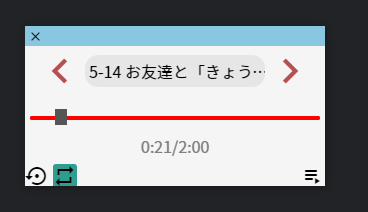
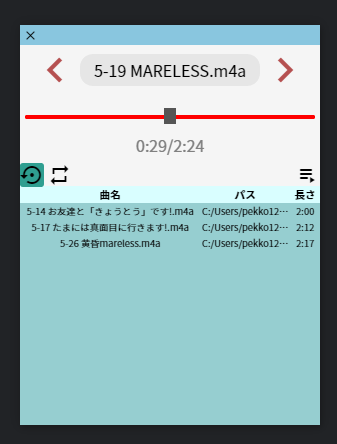

#Toivoa(トイボア)
#### electron製オーディオプレイヤー
  
  
  

## インストール
```
git clone https://github.com/pekko1215/Toivoa.git
cd Toivoa
npm install
electron .
```

## 使い方
1. 再生キュー  
を押すと再生キューが開きます。  
キューにファイルをD&Dすることで音楽が登録され、上から順番に再生が開始されます。  

2. リピート
を押すと、現在再生している音楽をリピート再生します。  

3. リサイクル
を押すと、再生が終わった音楽をキューの最後に追加します。  
